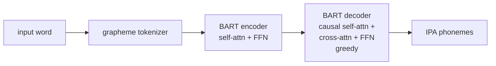

# swift-bart-g2p

neural grapheme-to-phoneme in pure Swift. feed it a word, get IPA phonemes back.

BART-tiny architecture. 752K parameters. 3MB weights. only dependency is Accelerate.

built for OOV word pronunciation -- when your TTS engine hits "kubernetes" and has no idea what to do.

## install

```swift
// Package.swift
dependencies: [
    .package(url: "https://github.com/Jud/swift-bart-g2p.git", branch: "main"),
]
```

## usage

```swift
import BARTG2P

let g2p = BARTG2P.fromBundle()!

g2p.predict("kubernetes")                     // "kˌubəɹnˈits" (~1.7ms, beam search + trigram LM)
g2p.predict("kubernetes", rescoreLM: false)   // greedy only (~0.6ms, slightly less accurate)
```

## architecture



single encoder layer, single decoder layer. KV-cached autoregressive decoding with optional beam search + phoneme trigram LM rescoring. all matrix ops go through `cblas_sgemm` / `vDSP`. weights loaded from safetensors at init.

## accuracy

on 1000-word CMUdict sample:

| mode | exact match | loose match | PER |
|------|-------------|-------------|-----|
| greedy (default) | 35.7% | 49.5% | 12.8% |
| rescoreLM | 37.5% | 52.1% | 12.1% |

"loose" normalizes stress markers and allophones before comparison. PER = phoneme error rate.

## model

- **source**: [PeterReid/graphemes_to_phonemes_en_us](https://huggingface.co/PeterReid/graphemes_to_phonemes_en_us)
- **d_model**: 128
- **layers**: 1 encoder, 1 decoder
- **attention heads**: 1 per layer
- **FFN dim**: 1024
- **vocab**: 63 tokens (graphemes + phonemes, shared embedding)
- **weights**: safetensors, ~3MB bundled in SPM resources
- **platform**: macOS 14+

## license

Apache 2.0
